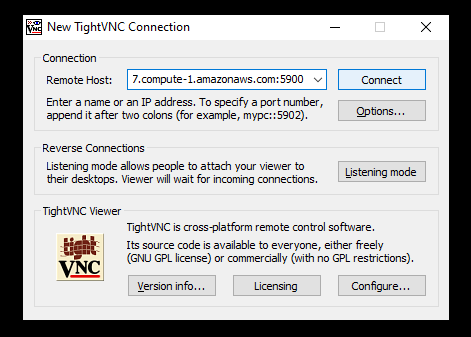
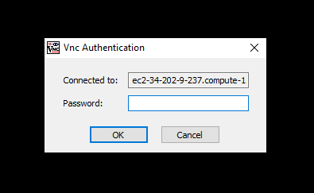
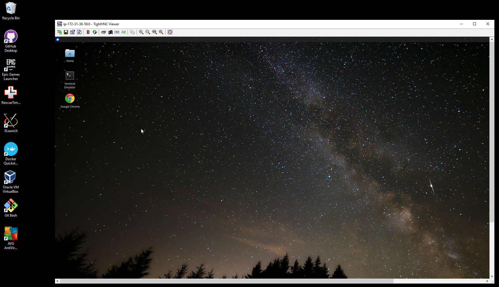

# Connec to your VM using VNC

## NOTE
This guide only applies to instances that have been configured using the given AMIs. If you're launching your own non-GPU instance and don't need access to a desktop GUI, simple RDP connections will work

## Connecting using VNC

Following on from launching a VM, let's connect to it using TightVNC on a Windows machine

TightVNC can be downloaded from [here](https://www.tightvnc.com/download.php)

Run the instance-info script with the 'running' flag to get a list of instances currently in the Running state

    python instance-info.py --state running

This should populate the config.ini file with the details of the 
isntance, including the instance ID and the IP address and such. 

Now, launch TightVNC. It should open up a window with a field for the remote host. The public IP address is the remote host and we'll connec to port 5900 where the VNC service is running. 

Copy the public IP and append the port 5900 at the end as follows:
    [publicIP]:5900 

and paste it into the Remote Host field on TightVNC. Click on Connect. Copy the instance ID and paste as password. 

You should be logged in 
